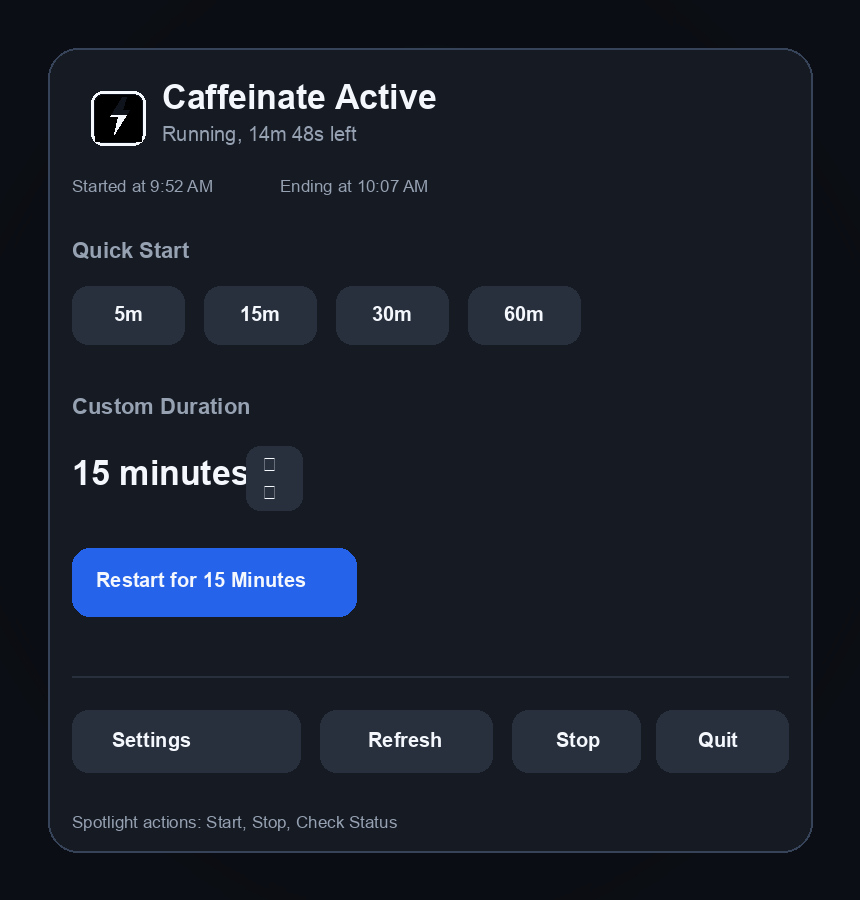
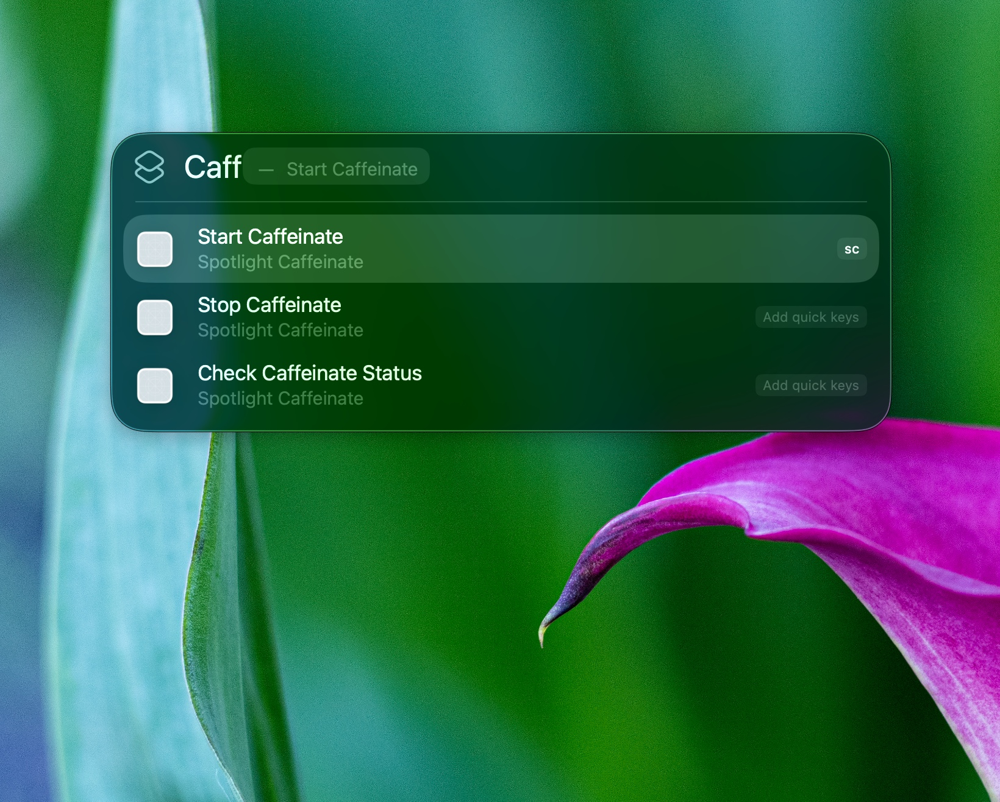
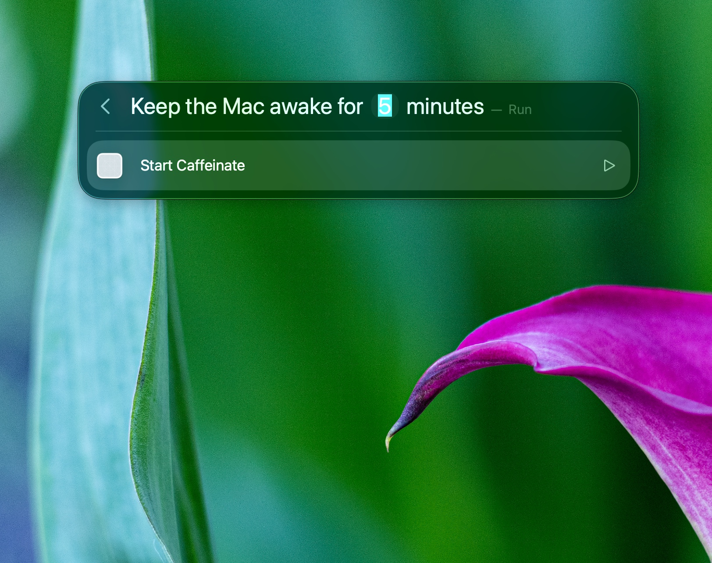
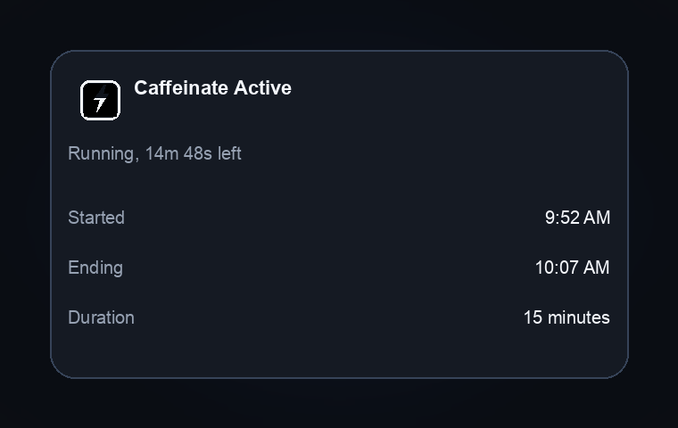
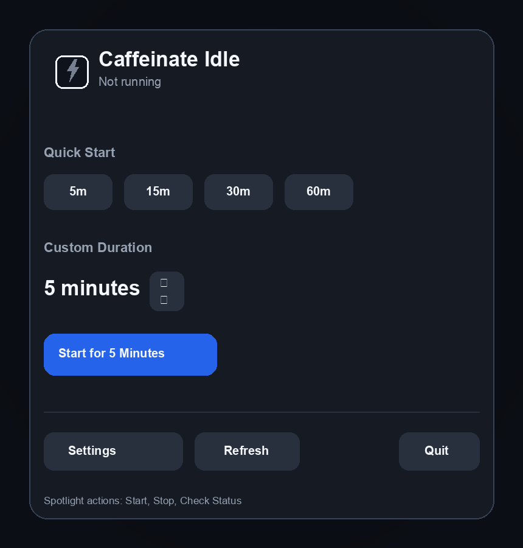

# Spotlight Caffeinate

Keep your Mac awake from Spotlight, the menu bar, or the terminal.

`Spotlight Caffeinate` is a focused macOS 26 utility built around one job: running `/usr/bin/caffeinate` with a friendlier interface. It stays intentionally narrow instead of becoming a generic terminal wrapper, which keeps the Spotlight actions clear, the process model simple, and the status tracking reliable.

<p align="center">
  
</p>

## Why It Exists

The built-in `caffeinate` command is good at starting an assertion, but not at answering practical questions later.

- Is it still running?
- How much time is left?
- Can I start it from Spotlight without remembering flags?
- Can I check the same state from the menu bar and the terminal?

This app adds that missing layer.

## What You Get

- Spotlight actions to start, stop, and check status
- A menu bar extra with active and idle states
- A live countdown while `caffeinate` is running
- An optional icon-only menu bar mode with a draining progress glyph
- An optional launch-at-login toggle in the menu bar UI
- Optional completion notifications with an in-app opt-in toggle
- An immediate confirmation banner when notifications are enabled
- A companion CLI for terminal-only environments
- Shared state between the app, Spotlight, and the CLI

## Screenshots

<table>
  <tr>
    <td width="50%">
      
    </td>
    <td width="50%">
      
    </td>
  </tr>
  <tr>
    <td width="50%">
      
    </td>
    <td width="50%">
      
    </td>
  </tr>
</table>

## Install

The app is distributed as a Homebrew cask:

```bash
brew install --cask TaylorFinklea/tap/spotlight-caffeinate
```

If Gatekeeper blocks first launch, remove quarantine and try again:

```bash
xattr -dr com.apple.quarantine "/Applications/Spotlight Caffeinate.app"
```

After launch, use `Cmd-Space` and search for:

- `Start Caffeinate`
- `Stop Caffeinate`
- `Check Caffeinate Status`

For the start action, tab into the `Minutes` field, type a duration such as `5`, then press `Return`.

If you turn notifications on from the menu bar UI, macOS will ask for notification permission at that moment. You can turn the setting back off at any time.

## Signed Releases

For direct distribution outside Homebrew, the repo now includes a Developer ID and notarization path.

One-time notary setup:

```bash
./scripts/configure_notarytool_profile.sh spotlight-caffeinate-notary --team-id YOURTEAMID
```

Build a signed release:

```bash
./scripts/package_signed_release.sh --team-id YOURTEAMID
```

Build a signed and notarized release:

```bash
./scripts/package_signed_release.sh --team-id YOURTEAMID --notary-profile spotlight-caffeinate-notary
```

Full setup notes live in [docs/developer-id-notarization.md](docs/developer-id-notarization.md).
The signed-build validation checklist lives in [docs/release-checklist.md](docs/release-checklist.md).

## CLI

The repo also ships a companion CLI for machines where installing the app into `/Applications` is not practical.

```bash
spotlight-caffeinate-cli start 15
spotlight-caffeinate-cli status
spotlight-caffeinate-cli watch
spotlight-caffeinate-cli stop
```

Build and install it into `~/.local/bin`:

```bash
./scripts/install_cli.sh
```

If `~/.local/bin` is not already on your `PATH`, add it in your shell profile before invoking `spotlight-caffeinate-cli` directly.

Install it somewhere else by passing a destination directory:

```bash
./scripts/install_cli.sh /usr/local/bin
```

The CLI uses the same shared state file as the menu bar app, so both surfaces report the same active run.

## Development

Generate the Xcode project:

```bash
xcodegen generate
open SpotlightCaffeinate.xcodeproj
```

Build the app target:

```bash
xcodebuild -project SpotlightCaffeinate.xcodeproj -scheme SpotlightCaffeinate -configuration Debug -destination 'platform=macOS' CODE_SIGNING_ALLOWED=NO build
```

Build the CLI target:

```bash
xcodebuild -project SpotlightCaffeinate.xcodeproj -scheme SpotlightCaffeinateCLI -configuration Debug -destination 'platform=macOS' CODE_SIGNING_ALLOWED=NO build
```

Run the test target:

```bash
xcodebuild -project SpotlightCaffeinate.xcodeproj -scheme SpotlightCaffeinate -configuration Debug -destination 'platform=macOS' CODE_SIGNING_ALLOWED=NO test
```

For Spotlight indexing, copy the built app into `/Applications`.

## Notes

- The app only tracks the `caffeinate` process it launches itself.
- The current implementation runs `caffeinate -disu -t <seconds>`.
- State is shared through a JSON file in `~/Library/Application Support/SpotlightCaffeinate/state.json`.
- Release builds intended for direct distribution should use `scripts/package_signed_release.sh` so they are signed with Hardened Runtime enabled.

## License

This project is licensed under the GNU General Public License v3.0. See [LICENSE](LICENSE).
